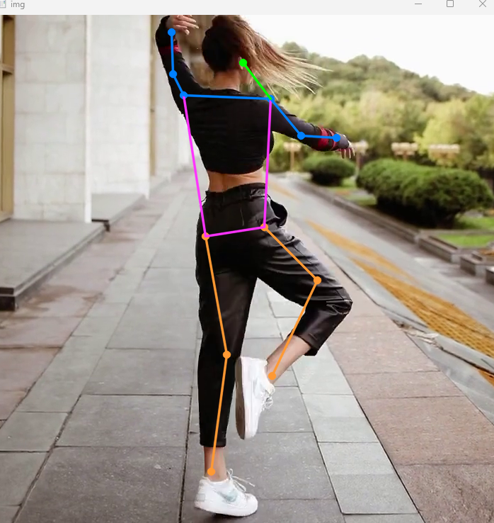

# YOLO Pose Classification

## Table of Contents

+ [Introduction](#introduction)
+ [Interface Ressult](#interface)
+ [License](#license)

## Introduction 
- Trích chọn khung xương cơ thể phục vụ việc phân loại
## Here are some results 

## License 

This project is licensed under the Apache License - see the [LICENSE](LICENSE) file for details.
